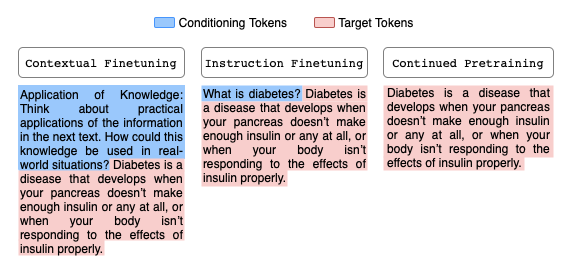

# Teaching LLMs How to Learn with Contextual Fine-Tuning

*Younwoo Choi\*, Muhammad Adil Asif\*, Ziwen Han, John Willes, Rahul Krishnan* <br>
Project Page: [https://younwoochoi.github.io/cft-iclr/](https://younwoochoi.github.io/cft-iclr/)

<p align="center">
  
  <br>
</p>

## Directory Structure

- `vectorlm/`: Main training scripts and core implementation
- `synthetic-exp/`: Synthetic experiments and evaluations

## Usage

The main training pipeline is implemented in the `vectorlm` directory, which contains the core functionality for contextual fine-tuning.

For experiments with Gemini-1.5-Flash, refer to the `gemini-exp` directory.

For synthetic experiments and controlled evaluations, refer to the `synthetic-exp` directory.

## Citation

```bibtex
@inproceedings{
    choi2025teaching,
    title={Teaching {LLM}s How To Learn with Contextual Fine-Tuning},
    author={Younwoo Choi and Muhammad Adil Asif and Ziwen Han and John Willes and Rahul G. Krishnan},
    booktitle={The Thirteenth International Conference on Learning Representations},
    year={2025},
    url={https://arxiv.org/abs/2503.09032}
}
```
